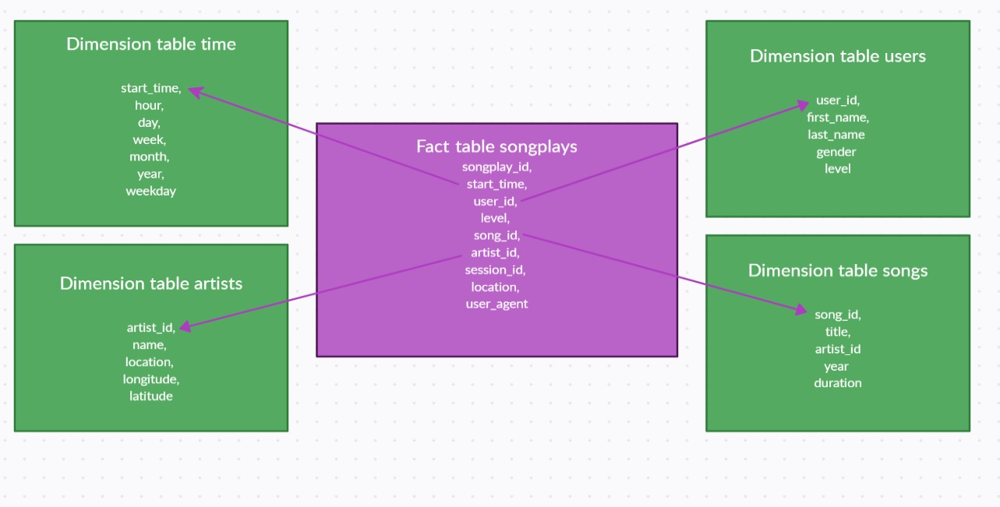

## Database schema design and ETL process

Sparkify has provided the song_data and log_data in the respective paths of the output bucket: s3://udacity-dend.
The code reads in the song_data and the log_data from the respective bucket paths and creates a Spark Dataframe thereof.

The dimension tables "songs" and "artists" are created on the basis of the song Dataframe, while the log Dataframe is the basis for the dimension tables "users" and "time"; the fact table "songplays" includes data both from the song and the log Dataframe.

The modelled tables are written into the following S3 bucket: "s3a://sparkifykarinalbiez"

The below image illustrates the structure of the fact and dimension tables:

## How to run the Python project
In order to run the project, please kindly run the following file:

etl.py
